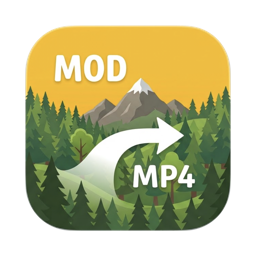

# MOD to MP4

 

A small Mac app that turns the `.MOD` recordings of old standard-definition camcorders
(JVC Everio, Panasonic SDR, Canon FS series and others that used the `.MOD`/`.MOI` pair)
into MP4 files that play everywhere: iMovie, QuickTime, Apple TV, iPhone, Windows, VLC.

For each camera folder (or a selection of clips) it makes:

1. **One merged video**, in recording order, with a chapter per clip and, optionally, the
   recording date and time burned in for a few seconds at the start of each clip in retro
   camcorder digits.
2. **Optionally, one MP4 per clip** in the camera folder, named after the recording time,
   cut from the merged video without re-encoding.

It reads the recording date/time and the real aspect ratio (4:3 or 16:9) from the `.MOI`
files, which most converters ignore, deinterlaces to 50p, fixes the colour tagging that makes
these files look washed out in QuickTime, and sets the file dates to the recording time so
Finder and Photos sort them correctly. Your original files are never modified.

## Why not just use HandBrake or an online converter?

Generic converters treat a `.MOD` file as "some MPEG-2 video" and throw the rest away.
This app is built around what these camcorders actually recorded:

- **Recording date and time** come from the `.MOI` sidecar file and end up in three places:
  as chapter titles, burned into the picture (optional), and as the file's creation date,
  so Finder and Photos sort your holiday in the right order.
- **Correct aspect ratio.** Many of these cameras stored 16:9 only in the `.MOI`; other tools
  show the footage squeezed into 4:3.
- **One video per holiday, in order**, with a chapter per clip, so you can scrub through a
  trip instead of 95 loose files. The clips are sorted by recording time, not by file name,
  which wraps around on these cameras.
- **Loss-free per-clip files** cut from the merged video on exact keyframes, if you want them.
- **Colour that looks the same everywhere.** The source is tagged in a way QuickTime and VLC
  interpret differently; the output is converted and tagged as BT.709.
- **Proper deinterlacing** to 50 frames per second, so pans stay smooth.
- **Nothing to install**: ffmpeg is bundled, the originals are never touched, and files that
  are still in iCloud are fetched first.

**The app is in English and Dutch** (it follows your Mac's language).

## Install

1. Download the latest zip from [Releases](../../releases/latest) and unzip it.
2. Drag **MOD to MP4.app** to your Applications folder.
3. First launch: macOS will say the app cannot be opened because the developer is not
   verified (it is not notarized with Apple). Open **System Settings → Privacy & Security**,
   scroll down and click **Open Anyway**. This is needed once per version.
4. The app checks for updates itself and offers to install them.

Requirements: a Mac with Apple Silicon (M1 or newer) and macOS 14 or newer.

## Use

Choose the camera folder (or drop it on the window). The clips appear grouped by day with
thumbnails; click to include or exclude, shift-click for a range, double-click to preview.
Adjust the options (each has an explanation), then click **Maak video** ("Make video").

## About this project

This is a hobby project, made to rescue old camcorder recordings and shared in case it
helps others with the same cameras. It is provided as is, without warranty. It was
built together with [Claude](https://claude.com) (Claude Fable 5.1, via Claude Code): the
design decisions and testing were done by a human, most of the code was written by the model.
Found a problem? Open an [issue](../../issues).

## Licences and third-party software

- **ffmpeg** — the app bundles a statically built `ffmpeg` and `ffprobe` (arm64, built by
  [martin-riedl.de](https://ffmpeg.martin-riedl.de/) from FFmpeg git, with x264 and others).
  These builds are licensed under the **GNU GPL v3**. The app starts them as separate programs.
  Library versions: [docs/ffmpeg-versions.txt](docs/ffmpeg-versions.txt). Source code:
  [ffmpeg.org](https://ffmpeg.org/download.html), [x264](https://www.videolan.org/developers/x264.html);
  the build scripts are published by the builder. On request I will provide the corresponding
  sources for the bundled version.
- **Sparkle** (software updates) — MIT licence, [sparkle-project.org](https://sparkle-project.org).
- **DSEG** font for the date stamp — SIL Open Font License, [keshikan/DSEG](https://github.com/keshikan/DSEG).
- H.264 and MPEG-2 are patented formats; FFmpeg's own [legal page](https://ffmpeg.org/legal.html)
  explains the situation. This app is free and non-commercial.

## Notes

- This repository holds the releases and the update feed (`appcast.xml`) only; the source code is not published.
- Works without Homebrew or any other installation: everything needed is inside the app.

---

## Nederlands

Mac-app die opnames van oude SD-camcorders (`.MOD` + `.MOI`, zoals de JVC Everio) omzet naar
MP4: één chronologische video met hoofdstukken en datumstempel, plus losse clips.

**Installeren:** download de zip onder [Releases](../../releases/latest), pak uit, sleep de
app naar Programma's. De eerste keer: Systeeminstellingen → Privacy en beveiliging → "Toch
openen". Daarna meldt de app zelf als er een nieuwe versie is.
Vereist: Mac met Apple Silicon, macOS 14 of nieuwer.
